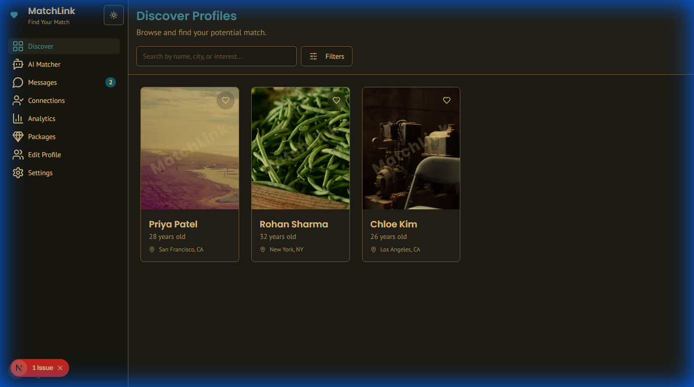
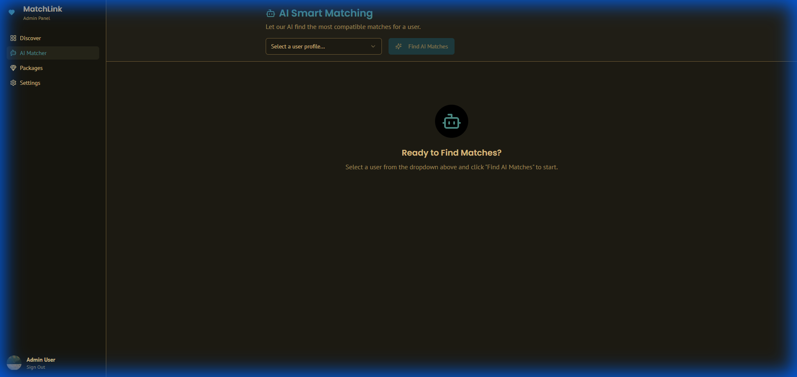
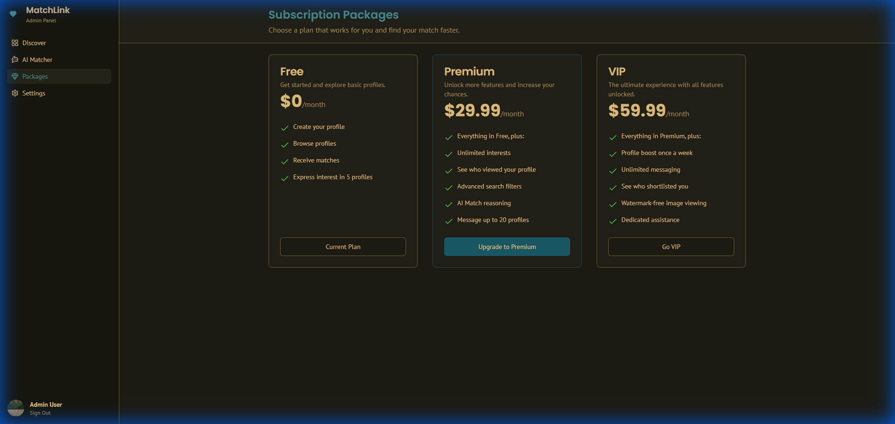

# 💕 MatchLink - AI-Powered Matchmaking Platform

[](https://match-link-tau.vercel.app/)
[](https://nextjs.org)
[](https://www.typescriptlang.org/)

> Intelligent matchmaking platform with AI-powered compatibility matching and profile management

**Live Demo:** https://match-link-tau.vercel.app/
Screenshots

| Discovery | AI Matching |
|:---:|:---:|
|  |  |

| Packages | Messages |
|:---:|:---:|
|  |
---

## Overview

MatchLink is a modern matchmaking web application featuring profile discovery, AI-powered compatibility scoring, and subscription packages. Built with Next.js 15 and TypeScript.

---

## Features

### Profile Discovery
- Browse user profiles with photos and details
- View detailed profile information
- Filter profiles by preferences
- Responsive card-based layout

### AI Matcher
- Compatibility scoring system
- Preference-based recommendations
- Match suggestions based on interests

### Subscription Packages
- Multiple tier offerings
- Premium feature access
- Subscription management UI

### User Interface
- Modern, clean design
- Fully responsive layout
- Smooth animations
- Intuitive navigation

---

## Tech Stack

**Frontend**
- Next.js 15 (App Router)
- TypeScript
- Tailwind CSS
- shadcn/ui components
- React Context for state

**Deployment**
- Vercel

---

## Quick Start

### Prerequisites
- Node.js 18+
- npm or yarn

### Installation

```bash
# Clone repository
git clone https://github.com/unnita1235/MatchLink.git
cd MatchLink

# Install dependencies
npm install

# Run development server
npm run dev
```

Open http://localhost:3000

---

## Project Structure

```
MatchLink/
├── src/
│   ├── app/
│   │   ├── page.tsx           # Home/Discover page
│   │   ├── match/             # AI Matcher
│   │   ├── packages/          # Subscription plans
│   │   ├── profile/[id]/      # Profile details
│   │   └── settings/          # User settings
│   ├── components/
│   │   ├── ProfileCard.tsx
│   │   ├── MatchScore.tsx
│   │   └── ui/               # shadcn/ui components
│   └── lib/
│       ├── api.ts
│       └── types.ts
└── package.json
```

---

## Current Implementation

✅ **Working Features:**
- Profile browsing
- Profile detail pages
- AI matcher page UI
- Subscription packages display
- Responsive design

🚧 **In Development:**
- User authentication
- Backend integration
- Real matching algorithm
- Payment processing

📅 **Planned Features:**
- Real-time messaging
- Video calls
- Advanced filters
- Mobile app

---

## Environment Setup

Create `.env.local` (if using Firebase or other services):

```env
# Add your configuration here when implementing backend
NEXT_PUBLIC_FIREBASE_API_KEY=your_key_here
NEXT_PUBLIC_FIREBASE_AUTH_DOMAIN=your_domain
# ... etc
```

---

## Development Scripts

```bash
npm run dev      # Start development server
npm run build    # Build for production
npm run start    # Start production server
npm run lint     # Run ESLint
```

---

## Current Status

This is an **active development project** focused on frontend implementation. The current version demonstrates:

- Modern UI/UX design patterns
- Responsive layout techniques
- Component architecture
- TypeScript implementation

**Note:** Backend features (authentication, real matching, payments) are planned for future development.

---

## Roadmap

### Phase 1 (Current)
- ✅ Profile browsing
- ✅ Profile details
- ✅ AI matcher UI
- ✅ Subscription packages UI

### Phase 2 (Next)
- 🚧 User authentication
- 🚧 Backend integration
- 🚧 Real matching algorithm

### Phase 3 (Future)
- 📅 Real-time messaging
- 📅 Payment integration
- 📅 Advanced search
- 📅 Video calls
- 📅 Mobile app

---

## Contributing

This is a personal project, but feedback and suggestions are welcome via GitHub issues.

---

## License

MIT License - See [LICENSE](LICENSE)

---

## Author

**Unni T A**
- GitHub: [@unnita1235](https://github.com/unnita1235)
- Email: unnita1235@gmail.com

---

**MatchLink** - Building Modern Matchmaking Experiences

*Note: This project is in active development. The current version focuses on frontend functionality with backend integration planned for future phases.*
