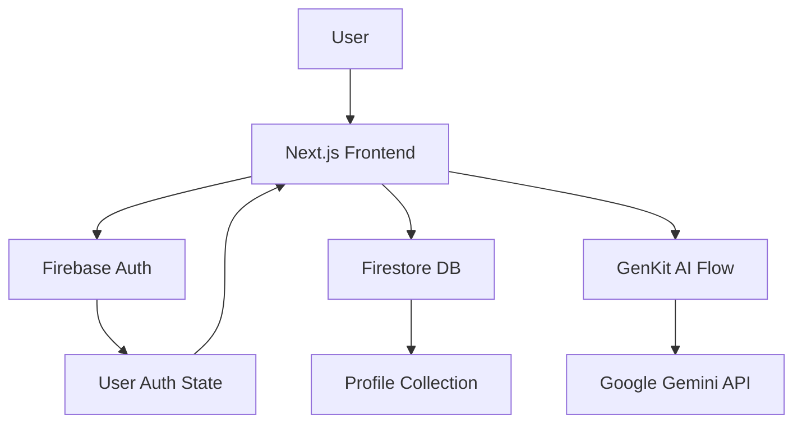

# MatchLink

> **A modern AI-powered matchmaking platform built with Next.js 15, Firebase, and Google Gemini AI**

[](https://match-link-tau.vercel.app)
[](LICENSE)
[](https://nextjs.org/)
[](https://www.typescriptlang.org/)

**MatchLink** is a full-stack matrimonial/dating platform that combines modern web technologies with AI-powered matching algorithms to help users find meaningful connections. The application features a Tinder-style discovery interface, comprehensive user profiles, and intelligent match suggestions powered by Google's Gemini AI through Firebase GenKit.

---

## 📋 Table of Contents

- [Overview](#-overview)
- [Current Status](#-current-status)
- [Features](#-features)
- [Tech Stack](#-tech-stack)
- [Project Structure](#-project-structure)
- [Getting Started](#-getting-started)
- [Configuration](#-configuration)
- [Deployment](#-deployment)
- [Architecture](#-architecture)
- [Limitations & Roadmap](#-limitations--roadmap)
- [Contributing](#-contributing)
- [License](#-license)

---

## 🎯 Overview

MatchLink is a **production-ready prototype** of a matchmaking platform that demonstrates:

- ✅ Modern React/Next.js architecture with Server Components
- ✅ Firebase Authentication (email/password)
- ✅ Cloud Firestore for data persistence
- ✅ AI-powered compatibility matching using Google Gemini
- ✅ Responsive, mobile-first UI with Tailwind CSS
- ✅ Type-safe development with TypeScript
- ✅ Production deployment on Vercel/Render

The platform is designed with Indian matrimonial preferences in mind, including fields for religion, caste, family details, and partner preferences, while maintaining a modern, universal appeal.

---

## 🚦 Current Status

**Project Maturity**: **Beta / Feature-Complete Prototype**

### What Works ✅

| Feature | Status | Notes |
|---------|--------|-------|
| User Authentication | ✅ Fully Functional | Email/password via Firebase Auth |
| Profile Creation/Editing | ✅ Fully Functional | Rich profiles with photos, bio, interests |
| Discovery/Swiping | ✅ Fully Functional | Tinder-style card interface with like/pass/super-like |
| Profile Database | ✅ Fully Functional | Firestore with real-time sync |
| AI Matching (GenKit) | ✅ Implemented | Compatibility scoring with Gemini AI |
| Mock Data Fallback | ✅ Working | 10 demo profiles for testing |
| Responsive Design | ✅ Complete | Mobile, tablet, desktop optimized |
| Type Safety | ✅ Complete | Full TypeScript coverage |

### What's Limited ⚠️

| Feature | Status | Limitation |
|---------|--------|------------|
| Messaging System | 🟡 UI Only | Chat interface exists but no real-time messaging backend |
| Payment Integration | 🟡 UI Only | Package selection UI without payment processing |
| Image Upload | 🟡 Limited | No cloud storage integration (uses URLs only) |
| Analytics Dashboard | 🟡 UI Only | Mock data, no real analytics tracking |
| Email Notifications | ❌ Not Implemented | No email service integration |
| Push Notifications | ❌ Not Implemented | No notification system |
| Video Calls | ❌ Not Implemented | No WebRTC integration |
| Profile Verification | ❌ Not Implemented | No identity verification system |

###  Deployment Status

- **Frontend**: Deployed on Vercel ([Live Demo](https://match-link-tau.vercel.app))
- **Backend Services**: Firebase (Auth + Firestore)
- **Alternative Deployment**: Render.yaml configuration included

---

## 📸 Screenshots

### Dashboard - Discover Profiles
Browse potential matches in a clean, modern grid interface with AI-powered suggestions.


### AI Smart Matching
AI-powered compatibility matching using Google Gemini to find the best connections based on personality, interests, and preferences.


### Subscription Packages
Choose from Free, Premium, or VIP tiers with transparent pricing and features.


---

## ✨ Features

### 1. **User Authentication & Profiles**
- Email/password authentication with Firebase
- Comprehensive profile creation with:
  - Personal details (name, age, gender, location, height)
  - Multiple profile photos
  - Bio and interests
  - Education and occupation
  - Religion and caste information
  - Family details
  - Partner preferences (age range, height, interests)

### 2. **Discovery & Matching**
- Tinder-style swipe interface
- Three interaction modes:
  - ❌ Pass (not interested)
  - ❤️ Like (send interest)
  - ⭐ Super Like (priority notification)
- Undo functionality
- Match detection with celebration dialog
- Profile quick preview and detailed view

### 3. **AI-Powered Matching**
- Google Gemini AI integration via Firebase GenKit
- Compatibility scoring algorithm (0-100)
- Personality and interest-based matching
- Detailed reasoning for match suggestions
- Partner preference alignment analysis

### 4. **User Interface Pages**
- **Discover**: Main swipe/browse interface
- **Connections**: View mutual matches and sent/received interests
- **Messages**: Chat interface (UI ready)
- **AI Match**: AI-powered match suggestions
- **Packages**: Subscription tier selection
- **Profile**: User profile management
- **Settings**: Account and preference settings
- **Analytics**: Usage statistics (mock data)

### 5. **Design & UX**
- Modern glassmorphism design
- Gradient backgrounds and smooth animations
- Dark mode support (via system preferences)
- Mobile-first responsive design
- Radix UI component library
- shadcn/ui components for consistency
- Toast notifications for user feedback

---

## 🛠️ Tech Stack

### **Frontend**
- **Framework**: [Next.js 15.4.0](https://nextjs.org/) (App Router, React 18.2)
- **Language**: [TypeScript 5.x](https://www.typescriptlang.org/)
- **Styling**: [Tailwind CSS 3.4](https://tailwindcss.com/) + [shadcn/ui](https://ui.shadcn.com/)
- **UI Components**: [Radix UI](https://www.radix-ui.com/) primitives
- **Forms**: [React Hook Form](https://react-hook-form.com/) + [Zod](https://zod.dev/) validation
- **Icons**: [Lucide React](https://lucide.dev/)
- **Animations**: Tailwind CSS Animate

### **Backend & Services**
- **Authentication**: [Firebase Auth](https://firebase.google.com/docs/auth)
- **Database**: [Cloud Firestore](https://firebase.google.com/docs/firestore)
- **AI/ML**: [Firebase GenKit](https://firebase.google.com/docs/genkit) + [Google Gemini AI](https://ai.google.dev/)
- **Hosting**: [Vercel](https://vercel.com/) (Frontend) / [Render](https://render.com/) (Alternative)

### **Development Tools**
- **Linting**: ESLint 9.x with Next.js config
- **Type Checking**: TypeScript strict mode
- **Package Manager**: npm
- **Dev Server**: Next.js Turbopack
- **Version Control**: Git + GitHub

### **Key Dependencies**
```json
{
  "next": "15.4.0",
  "react": "18.2.0",
  "typescript": "^5",
  "firebase": "^11.9.1",
  "genkit": "^1.14.1",
  "@genkit-ai/googleai": "^1.14.1",
  "tailwindcss": "^3.4.1",
  "zod": "^3.24.2"
}
```

---

## 📁 Project Structure

```
MatchLink/
├── src/
│   ├── app/                          # Next.js 15 App Router
│   │   ├── (auth)/                   # Authentication routes (grouped)
│   │   │   ├── login/                # Login page
│   │   │   └── signup/               # Signup page
│   │   ├── (dashboard)/              # Main app routes (grouped)
│   │   │   ├── discover/             # ⭐ Main discovery/swipe page
│   │   │   ├── connections/          # Matches and interests
│   │   │   ├── messages/             # Chat interface
│   │   │   ├── match/                # AI-powered matching
│   │   │   ├── profile/              # User profile pages
│   │   │   │   └── [id]/             # Dynamic profile routes
│   │   │   ├── packages/             # Subscription packages
│   │   │   ├── settings/             # User settings
│   │   │   ├── analytics/            # Usage analytics
│   │   │   ├── layout.tsx            # Dashboard layout
│   │   │   └── page.tsx              # Dashboard home
│   │   ├── welcome/                  # Landing/welcome page
│   │   ├── seed/                     # Database seeding utilities
│   │   ├── actions.ts                # Server actions
│   │   ├── globals.css               # Global styles
│   │   └── layout.tsx                # Root layout
│   │
│   ├── components/
│   │   └── ui/                       # Reusable UI components (40+ components)
│   │       ├── button.tsx
│   │       ├── card.tsx
│   │       ├── dialog.tsx
│   │       ├── avatar.tsx
│   │       └── ... (shadcn/ui components)
│   │
│   ├── lib/                          # Core utilities and data
│   │   ├── firebase.ts               # Firebase initialization
│   │   ├── db.ts                     # Firestore helpers (CRUD operations)
│   │   ├── data.ts                   # Mock profile data (10 profiles)
│   │   ├── types.ts                  # TypeScript type definitions
│   │   ├── utils.ts                  # Utility functions
│   │   ├── placeholder-images.ts     # Image placeholders
│   │   └── placeholder-images.json   # Image data
│   │
│   ├── ai/                           # AI/GenKit integration
│   │   ├── genkit.ts                 # GenKit configuration
│   │   ├── dev.ts                    # Development server
│   │   └── flows/
│   │       └── ai-powered-matching.ts # AI matching flow
│   │
│   ├── context/
│   │   └── AuthContext.tsx           # Firebase Auth context
│   │
│   └── hooks/
│       └── use-toast.ts              # Toast notification hook
│
├── public/                            # Static assets
├── .github/workflows/                 # CI/CD (if configured)
├── docs/                              # Documentation
├── screenshots/                       # App screenshots
│
├── next.config.ts                     # Next.js configuration
├── tailwind.config.ts                 # Tailwind CSS configuration
├── tsconfig.json                      # TypeScript configuration
├── eslint.config.mjs                  # ESLint configuration
├── postcss.config.mjs                 # PostCSS configuration
├── render.yaml                        # Render deployment config
├── package.json                       # Dependencies
├── CONTRIBUTING.md                    # Contribution guidelines
├── LICENSE                            # MIT License
└── README.md                          # This file
```

---

## 🚀 Getting Started

### Prerequisites

- **Node.js**: 18.0.0 or higher
- **npm**: 9.0.0 or higher (comes with Node.js)
- **Firebase Account**: For authentication and database
- **Google Cloud Project**: For Gemini AI API access

### Installation

1. **Clone the repository**
   ```bash
   git clone https://github.com/unnita1235/MatchLink.git
   cd MatchLink
   ```

2. **Install dependencies**
   ```bash
   npm install
   ```

3. **Set up environment variables**
   
   Create a `.env.local` file in the root directory:
   ```env
   # Firebase Configuration
   NEXT_PUBLIC_FIREBASE_API_KEY=your_api_key_here
   NEXT_PUBLIC_FIREBASE_AUTH_DOMAIN=your_project.firebaseapp.com
   NEXT_PUBLIC_FIREBASE_PROJECT_ID=your_project_id
   NEXT_PUBLIC_FIREBASE_STORAGE_BUCKET=your_project.appspot.com
   NEXT_PUBLIC_FIREBASE_MESSAGING_SENDER_ID=your_sender_id
   NEXT_PUBLIC_FIREBASE_APP_ID=your_app_id

   # Google AI (for GenKit)
   GOOGLE_GENAI_API_KEY=your_gemini_api_key
   ```

   **Where to get these values:**
   - Firebase: [Firebase Console](https://console.firebase.google.com/) → Project Settings → General
   - Gemini API: [Google AI Studio](https://makersuite.google.com/app/apikey)

4. **Run the development server**
   ```bash
   npm run dev
   ```

   The app will be available at `http://localhost:9002` (custom port configured in package.json)

5. **Optional: Seed mock data**
   
   Navigate to `/seed` in your browser to populate Firestore with demo profiles.

---

## ⚙️ Configuration

### Firebase Setup

1. **Create a Firebase project**
   - Go to [Firebase Console](https://console.firebase.google.com/)
   - Create a new project
   - Enable Email/Password authentication in Authentication section
   - Create a Firestore database in production mode

2. **Firestore Security Rules** (recommended)
   ```javascript
   rules_version = '2';
   service cloud.firestore {
     match /databases/{database}/documents {
       match /profiles/{userId} {
         allow read: if request.auth != null;
         allow write: if request.auth != null && request.auth.uid == userId;
       }
     }
   }
   ```

3. **Enable Google AI**
   - Get API key from [Google AI Studio](https://makersuite.google.com/app/apikey)
   - Add to environment variables

### Available Scripts

```bash
# Development
npm run dev              # Start dev server on port 9002 with Turbopack
npm run genkit:dev       # Start GenKit development server
npm run genkit:watch     # Start GenKit with auto-reload

# Production
npm run build            # Create production build
npm run start            # Start production server

# Code Quality
npm run lint             # Run ESLint
npm run typecheck        # Run TypeScript type checking
```

---

## 🌐 Deployment

### Deploy to Vercel (Recommended)

1. **Push to GitHub**
   ```bash
   git push origin main
   ```

2. **Connect to Vercel**
   - Go to [Vercel Dashboard](https://vercel.com/dashboard)
   - Import your GitHub repository
   - Add environment variables from `.env.local`
   - Deploy

3. **Configure environment variables in Vercel**
   - Add all `NEXT_PUBLIC_*` variables
   - Add `GOOGLE_GENAI_API_KEY`

### Deploy to Render (Alternative)

The project includes a `render.yaml` configuration:

```bash
# Render will automatically detect and deploy using:
# - Build: npm install && npm run build
# - Start: npm run start
```

Add the same environment variables in Render dashboard.

---

## 🏗️ Architecture

### Data Flow



### Key Components

1. **Authentication Flow**
   - Firebase Auth handles email/password signup/login
   - `AuthContext` provides global auth state
   - Protected routes redirect unauthenticated users

2. **Profile Management**
   - Firestore stores user profiles in `/profiles/{userId}` collection
   - `db.ts` provides CRUD helpers
   - Mock data fallback for development (`data.ts`)

3. **Matching System**
   - Discovery page fetches all profiles (excluding current user)
   - User interactions (like/pass/super-like) tracked locally
   - Random match simulation (30% chance) on likes
   - AI matching uses GenKit flow with Gemini

4. **AI Integration**
   - `ai-powered-matching.ts` defines GenKit flow
   - Takes user profile + candidate profiles
   - Returns compatibility scores (0-100) with reasoning
   - Uses structured output with Zod schemas

---

## 🔮 Limitations & Roadmap

### Current Limitations (Brutal Honesty)

1. **No Real Messaging**: Chat UI exists but lacks backend implementation (needs real-time database or WebSocket)
2. **No Payment Processing**: Payment packages displayed but no Stripe/Razorpay integration
3. **No Image Uploads**: Profiles use URLs only; no Firebase Storage/Cloudinary integration
4. **Limited Scalability**: `getAllProfiles()` fetches all profiles (needs pagination for 1000+ users)
5. **No Email Notifications**: No SendGrid/AWS SES integration for match notifications
6. **No Profile Verification**: No ID verification or photo moderation
7. **Basic Analytics**: Mock data only, no real tracking (needs Google Analytics/Mixpanel)
8. **Mock Match Detection**: 30% random chance instead of checking mutual likes in database

### Roadmap

#### Phase 1: Core Functionality (Priority)
- [ ] Implement real-time messaging (Firestore or Socket.io)
- [ ] Add image upload with Firebase Storage
- [ ] Implement pagination for profile discovery
- [ ] Add proper mutual match detection (check likes in DB)
- [ ] Email notifications (SendGrid/Resend)

#### Phase 2: Monetization
- [ ] Payment integration (Stripe/Razorpay)
- [ ] Subscription management
- [ ] Feature gating based on packages

#### Phase 3: Trust & Safety
- [ ] Profile photo moderation (AI/manual)
- [ ] Report/block functionality
- [ ] ID verification system
- [ ] Content moderation

#### Phase 4: Growth
- [ ] Real analytics tracking
- [ ] SEO optimization
- [ ] Mobile app (React Native/Flutter)
- [ ] Advanced AI matching (learning from user feedback)
- [ ] Video profiles
- [ ] Virtual date features

---

## 🤝 Contributing

Contributions are welcome! Please read [CONTRIBUTING.md](CONTRIBUTING.md) for details.

### Development Workflow

1. Fork the repository
2. Create a feature branch (`git checkout -b feature/amazing-feature`)
3. Make your changes
4. Run type checking and linting:
   ```bash
   npm run typecheck
   npm run lint
   ```
5. Commit your changes (`git commit -m 'Add amazing feature'`)
6. Push to the branch (`git push origin feature/amazing-feature`)
7. Open a Pull Request

### Code Standards

- **TypeScript**: Strict mode enabled, no `any` types
- **Components**: Functional components with hooks
- **Styling**: Tailwind CSS utility classes
- **Formatting**: Follow existing code style
- **Commits**: Conventional commit messages

---

## 📄 License

This project is licensed under the **MIT License** - see the [LICENSE](LICENSE) file for details.

```
MIT License

Copyright (c) 2024 Unni T A

Permission is hereby granted, free of charge, to any person obtaining a copy
of this software and associated documentation files (the "Software"), to deal
in the Software without restriction...
```

---

## 👤 Author

**Unni T A**  
Full-Stack Developer

- 🌐 GitHub: [@unnita1235](https://github.com/unnita1235)
- 📧 Email: unnita1235@gmail.com
- 💼 LinkedIn: [Connect with me](https://linkedin.com/in/unnita1235)
- 🚀 Portfolio: [Your Portfolio](https://your-portfolio.com)

---

## 🙏 Acknowledgments

- **Next.js Team** - For the incredible React framework
- **Vercel** - For seamless deployment and hosting
- **Firebase** - For authentication and database services
- **Google** - For Gemini AI and GenKit
- **Radix UI** - For accessible component primitives
- **shadcn** - For beautiful UI components
- **Tailwind Labs** - For the utility-first CSS framework

---

## 📞 Support

If you have questions or need help:

1. **Check the docs**: This README and [CONTRIBUTING.md](CONTRIBUTING.md)
2. **Open an issue**: [GitHub Issues](https://github.com/unnita1235/MatchLink/issues)
3. **Email me**: unnita1235@gmail.com

---

## ⭐ Star History

If this project helped you, please consider giving it a ⭐ on [GitHub](https://github.com/unnita1235/MatchLink)!

---

**Project Status**: Active Development | **Last Updated**: January 2026

Made with ❤️ by [Unni T A](https://github.com/unnita1235)
